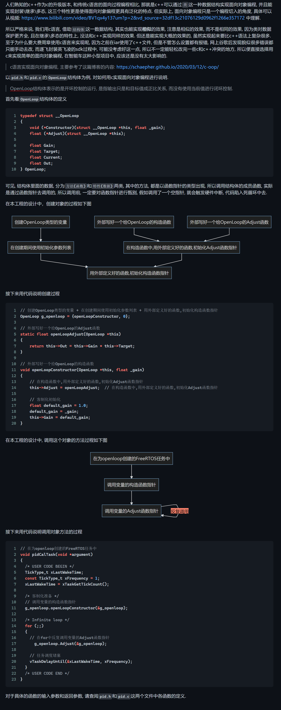

<!--
 * @Author: Jae Frank[thissfk@qq.com]
 * @Date: 2024-07
 * @LastEditors: Jae Frank[thissfk@qq.com]
 * @LastEditTime: 2024-08
 * @FilePath: README.md
 * @Description: 
 * If you need more information,
 * please contact Jae Frank[thissfk@qq.com] to get an access.   
 * Copyright (c) 2024 by Jae Frank, All Rights Reserved. 
  -->

 <u> **【写在前前前面】**</u>
 <u> **开源Gitee仓库链接：**</u>
 <u>**[https://gitee.com/hallo_frank/cyt4-bb7_-control_-middleware_-library.git](https://gitee.com/hallo_frank/cyt4-bb7_-control_-middleware_-library.git)**</u>

 <u> **开源CSDN链接：**</u>
 <u>**[CSDN链接](https://blog.csdn.net/m0_57145940/article/details/140856608?fromshare=blogdetail&sharetype=blogdetail&sharerId=140856608&sharerefer=PC&sharesource=m0_57145940&sharefrom=from_link)**</u>

------

**【写在前前面】特别感谢：**

1. **逐飞科技CYT4BB7开源库，本项目所有工作均基于[逐飞科技CYT4BB7开源库](https://gitee.com/seekfree/CYT4BB7_Library)，特此感谢逐飞科技的开发人员，为智能车er们带来了如此全面完整的解决方案。**
1. **越野信标组参赛队友及华南理工大学智能车队，在完成本项目的途中，假如缺少你们的帮助，硬件上的、软件上的、精神上的，本项目肯定没办法达到这样的完成度，特此感谢这些为本项目提供过各种帮助的智能车er们。**
3. **[华工机器人未来创新实验室](https://space.bilibili.com/523048929?spm_id_from=333.976.0.0)SRML库历代的各位缔造者和维护者，本项目copy了SRML多个文件的源码，特此感谢你们很好的轮子，使我的拿来主义旋转。**

------

<u>**【写在前面】特别说明：**</u>

<u>**本项目中多数文件开头都带有与本人相关的开头，如下：**</u>

```cpp
/*
 * @Author: Jae Frank[thissfk@qq.com]
 * @Date: 2024-06
 * @LastEditors: Jae Frank[thissfk@qq.com]
 * @LastEditTime: 2024-06
 * @FilePath: xxx.c
 * @Description:
 *            If you need more information,
 * please contact Jae Frank[thissfk@qq.com] to get an access.
 * Copyright (c) 2024 by Jae Frank, All Rights Reserved.
 */
```

<u>**此文件开头标识为VSCode插件设置好的自动插入，所以文件开头带有此标识不代表此文件的工作全部出自本人，因为本项目中还有大部分工作来自「[孟杨](https://gitee.com/mengyangce)」同学，更不代表本人否认或者想要侵占他人的工作成果，有些文件中原本的开头标识可能被本人误删，如果需要补充可以与本人联系更新，对此造成的误解与不便，敬请谅解！**</u>

------

*本项目主要特点有三：*

1. *移植了FreeRTOS操作系统，使用任务调度机制比裸机跑程序更有优势。*
2. *通过定时器中断实现了类似STM32中空闲中断的机制，实现串口数据的不定长接收，接收一些模块的数据时，不需要轮询查找帧头帧尾，更节省cpu资源。*
3. *使用c/c++混编实现了面向对象编程，相比面向过程编程，更自然直观也更解耦，并且也能用上c++的语法糖，编程开发更便捷。*

*本项目的其他小特点：*

1. *移植u8g2实现非线性菜单，纵享丝滑Q弹。*
2. *各种外设均由自己的独立任务进行驱动和数据采集，`AAARobot`类的实例化对象只通过对应外设的数据结构体来访问相应的信息，充分将底层外设和机器人控制逻辑层解耦。*
3. *在硬件中断处理函数中进行了软件重启，当由于奇怪的情况进入硬件中断后可以自动重启继续实现控制*
4. *……*

以上小特点均~~懒得码字~~不赘述，具体实现可以参考源码，下面只对主要特点进行详细介绍。

------

# FreeRTOS

这个工程中，给M0移植的是FreeRTOS的v1版本的源码，给M7移植的是v2的源码，源码都来自于cubemx给M0和M7生成的FreeRTOS源码

> 因为从FreeRTOS官网下载的源码移植后无法正常工作，并且v2版本的源码给M0核没办法正常工作，所以以上的版本安排会这么抽象

1. FreeRTOS的调度过程

   对于FreeRTOS调度过程，只需要知道FreeRTOS的启动过程即可，其余部分只求使用的话，不需要太深入了解

   从`main_cm7_0.c`中的`main`函数开始:

   ```c
   osKernelInitialize();
   usrSystemInit();      // 初始化系统
   osKernelStart();
   ```

   以上三行,第一行是初始化FreeRTOS的内核,不需要深入理解也可以。

   第二行是封装好的初始化系统的函数，这个函数里面先是对系统的GPIO、串口等外设进行初始化，然后对相关外设的FreeRTOS任务进行初始化。

   第三行是开启FreeRTOS的内核调度,从这个函数开始,正式进入了FreeRTOS掌控任务调度的时期,FreeRTOS会根据每个任务的运行频率(由客户设置)和优先级(由客户设置),来判断每个时刻的当下应该让哪个任务出于运行状态.

   以上,便是FreeRTOS启动的过程.

2. FreeRTOS任务的创建
   
   任务的创建一般先分配好相关的变量，然后通过以下这句代码实现最终的创建。
   
   ```cpp
    defaultTaskHandle = osThreadNew(StartDefaultTask, NULL, &defaultTask_attributes); // 4. 创建任务(给任务分配运行空间),并将任务句柄变量和任务函数\任务参数表链接起来
   ```
   
   创建一个`StartDefaultTask`的任务,`defaultTask_attributes`是这个任务的参数列表,里面包含了这个任务的调用空间大小\优先级等信息,而`defaultTaskHandle`是这个任务的句柄(handle的中文翻译),句柄可以理解成是一个令牌,古人使用令牌可以来指挥特定的军队,同样的,用户想要支配某个任务,就是操纵通过这个任务的句柄来实现.
   
   上面提到过了任务\任务参数表\任务句柄等概念,那么此处展开说一下这些概念
   
   **任务(任务函数)**: 这个指的是, 某个任务在运行时要执行的函数, 可以理解成这个任务所要执行的具体行为
   
   **任务参数列表**: 这个参数列表, 是一个`struct`结构体类型的数据, 包含了这个任务的名称字符串`name`, 任务运行的空间(栈)的大小`stack_size`以及任务的优先级`priority`.
   
   **任务句柄**: 当任务创建成功之后, 用户再要对某个任务进行任何的操作, 都是通过任务句柄即可访问到相对应任务的一切信息.
   
   下面用一份实例代码，说明具体的、完整的创建过程
   
   ```c
   #include "cmsis_os.h"
   
   // 启动任务
   osThreadId_t defaultTaskHandle; // 1. 创建好任务句柄
   const osThreadAttr_t defaultTask_attributes = { // 2.创建任务参数列表
       .name = "defaultTask", // 给这个任务的名字/描述信息
       .stack_size = 128 * 4, // 给这个任务安排的栈空间,一般在iar中,假如任务运行上溢出这个栈,就会进入硬件中断死循环
       .priority = (osPriority_t)osPriorityRealtime, // 给这个任务安排的优先级
   };
   void StartDefaultTask(void *argument); // 3. 创建任务函数的声明
   
   void main()
   {
     osKernelInitialize();
     defaultTaskHandle = osThreadNew(StartDefaultTask, NULL, &defaultTask_attributes); // 4. 创建任务(给任务分配运行空间),并将任务句柄变量和任务函数\任务参数表链接起来
     osKernelStart();
   }
   
   void StartDefaultTask(void *argument); // 5. 任务函数的定义, 任务中真正执行的事情
   {
    // ...暂时省略不写   
   }
   ```
   
   不难看出, 从上到下, 主要分为5步
   
   1. 创建任务句柄变量, 但此时只是创建了这个变量, 还没将这个变量和实际的任务实体进行链接
   
   2. 创建任务参数列表变量, 里面会对三个变量进行设置, 这些也就是对任务的设置
   
   3. 创建任务函数的声明, 因为一般情况下, 程序员都约定速成在文档的最上面先将函数进行声明, 在文档的最下面再对函数进行定义
   
   4. 创建任务, 通过调用`osThreadNew`函数, 加载了任务函数和任务参数表创建了任务, 并将这个任务与任务句柄进行了链接
   
   5. 任务函数的定义, 在这个任务中, 到底要做些什么, 就是在任务函数里面进行定义
   
3. 此工程中FreeRTOS任务的创建过程

   上面提到，在封装好的初始化系统函数`usrSystemInit`中会初始化相关外设和相关外设的FreeRTOS任务。

   ```cpp
   /**
    * @brief 用户系统初始化
    *
    */
   void usrSystemInit(void) {
     // 外设初始化
     usr_sys.peripheralInit();
   
     // 任务初始化
     usr_sys.TaskCreate();
     // 车子实例初始化
     car.init();
   }
   ```
   
   其中`usr_sys`是`USR_SYSTEM`类的一个实例化对象，通过调用类函数`peripheralInit`来进行外设初始化，调用类函数`TaskCreate`进行任务初始化。下面看一下类函数`TaskCreate`的内容。
   
   ```c
   /**
    * @brief 用户任务创建
    *
    */
   void USR_SYSTEM::TaskCreate() {
   
     // 创建默认任务
     defaultTaskHandle = osThreadNew(defaultTask, NULL, &defaultTask_attributes);
   
     // 创建显示任务
     oledTaskHandle = osThreadNew(oledTask, NULL, &oledTask_attributes);
   
   #if USE_FS_I6X
     // 创建FS_I6X任务
     remoteCtrlUnitTaskHandle =
         osThreadNew(tskFS_I6X, NULL, &remoteCtrlUnitTask_attributes);
   #else
     // 创建ps2任务
     remoteCtrlUnitTaskHandle =
         osThreadNew(ps2Task, NULL, &remoteCtrlUnitTask_attributes);
   #endif
   
     // 创建电机驱动任务
     motorTaskHandle = osThreadNew(motorTask, NULL, &motorTask_attributes);
   
     // 创建舵机转向任务
     servoTaskHandle = osThreadNew(servoTask, NULL, &servoTask_attributes);
   
   // 创建upperMonitor任务
   // upperMonitorTaskHandle =
   //     osThreadNew(upperMonitorTask, NULL, &upperMonitorTask_attributes);
   
   // 创建vofa任务
   #if !ADC_DATA_VIEW
     vofaTaskHandle = osThreadNew(vofaTask, NULL, &vofaTask_attributes);
   #endif
   }
   ```
   
   由==FreeRTOS任务的创建==所提到的内容, 不难看出, 这函数一次性将若干个任务的==创建任务==这一步给完成了。
   
   在这个项目中，整体的调用过程如下：
   
   `main`函数->`usrSystemInit`函数->通过`usr_sys`类对象调用` TaskCreate`类函数->完成所有外设任务的==创建任务==步骤。

# 串口空闲处理实现不定长接收

不定长接收对于串口信息接收有很大的帮助，借助不定长接收可以将接收到的信息分成不同长度的数据帧，随后便能很便捷地实现解包处理。

在STM32中, 串口可以开启空闲中断(`IDLE_INTERRUPT`), 开启了空闲中断的话, 硬件会自动识别串口接收数据的情况, 一般串口外设发送完一段数据后, 需要一段短暂停顿之后才能发送下一段数据, 故在两段数据之间, 会有一个比较短暂的停顿, 硬件接收完一个字节数据（一段数据的最后一个字节）后, 有一个短时间没有信息到来, 则会判断为这一段数据(约定俗成下会称这一段数据为一帧数据)已经接收完毕, 然后触发空闲中断, 在中断中, 用户即可通过一定的手段来判断这一帧数据一共有多少个字节, 这便是俗称的"不定长接收".

在cyt4887逐飞开发的代码框架中, 我并没有找到空闲中断的开启方法, 英飞凌的sdk中, 我也没有找到, 网上谷歌也没有这款芯片空闲中断的相关描述. 但根据以上所说的原理, 只要使用一个定时器中断, 提供串口外设的空闲判断工作, 也是能实现"空闲中断"的, 但显然这时候就不是中断了, 称为"空闲处理"更为恰当.

> 注: 通过STM32实现这种手动判断的原理可以参考https://blog.csdn.net/yychuyu/article/details/134768431的4.3节

在此工程中, 主要是仿照上述链接的4.3节, 魔改了逐飞的fifo结构体和逐飞的串口读取函数, 来实现不定长接收的工程

1. 设置用于串口空闲判断的定时器

   在`usr_system.cpp`文件的`USR_SYSTEM::peripheralInit`函数（表示`USR_SYSTEM`类的成员函数）中,使用`pit_us_init(PIT_CH0, 1000); // 设置周期中断1ms，用于串口空闲中断判断`设置PIC_CH0来完成这个功能

2. 在定时器中断中,完成空闲判断

   ```c
   /**
    * @brief 串口空闲状态判断
    *
    * @param pfifo
    * @return true
    * @return false
    */
   static bool isUartIdle(fifo_struct *pfifo) {
     if (pfifo->init_state == false ||
         (pfifo->head == 0 && pfifo->pre_head == 0)) {
       // 如果没有初始化过这个fifo || 没有数据，退出
       return false;
     }
   
     if (pfifo->head == pfifo->pre_head) {
       // 如果空闲了
       return true;
     }
   
     if (pfifo->head < pfifo->pre_head) {
       // 假如超过了数组长度
       return true;
     }
   
     // 如果在接收状态，也就是head变了，则更新pre_head
     pfifo->pre_head = pfifo->head;
     return false;
   }
   
   /**
    * @brief debug串口空闲中断处理函数
    *
    * @param pfifo 要被判断空闲状态的串口fifo
    * @param handle_func 空闲状态下要执行的处理函数
    */
   static void handleWhenIdle(uint8_t uart_id) {
     if (isUartIdle(puart_fifo_s[uart_id])) {
       // 如果空闲，执行处理函数
       if (uart_handle_callback_s[uart_id] != NULL) {
         uart_handle_callback_s[uart_id]((uint8_t *)puart_fifo_s[uart_id]->buffer,
   	puart_fifo_s[uart_id]->max -puart_fifo_s[uart_id]->size);
       }
   
       // clear fifo
       fifo_clear(puart_fifo_s[uart_id]);
     }
   }
   
   // **************************** PIT中断函数 ****************************
   void pit0_ch0_isr() {
     pit_isr_flag_clear(PIT_CH0);
   
     // 如果debug串口空闲，则执行处理
     // handleWhenIdle(0); // 串口0空闲时，进行回调处理
     handleWhenIdle(1); // 串口1空闲时，进行回调处理 gps
     handleWhenIdle(2); // 串口2空闲时，进行回调处理 遥控
     handleWhenIdle(3); // 串口3空闲时，进行回调处理 裁判
     handleWhenIdle(4); // 串口4空闲时，进行回调处理 电驱
   }
   ```
   
   上述的代码中, 最重要的就是`pit0_ch0_isr`函数中完成了所有的步骤, 上面的两个函数只是步骤的封装, 只是为了让最重要的`pit0_ch0_isr`看起来简洁的。对于`handleWhenIdle`函数中出现的`uart_handle_callback_s`、`puart_fifo_s`两个变量在`usr_uart.cpp`中被定义。在这里，只需大概地知道，这两个变量是将串口FIFO和串口不定长中断的回调函数进行了列表封装，目的是为了函数之间的封装和解耦。
   
   ```c
   // 串口的fifo
   fifo_struct uart0_fifo, uart1_fifo, uart2_fifo, uart3_fifo, uart4_fifo;
   // 串口fifo集合
   fifo_struct *puart_fifo_s[5] = {&uart0_fifo, &uart1_fifo, &uart2_fifo,&uart3_fifo, &uart4_fifo};
   //···//
   // 串口中断回调函数集合
   uart_handle_callback_t uart_handle_callback_s[5] = {
       refereeSystemUnpack,   // 串口0中断回调函数
       decodeUbxPVT,          // 串口1中断回调函数
       FS_I6X_RxCpltCallback, // 串口2中断回调函数
       refereeSystemUnpack,   // 串口3中断回调函数
       escDataUnpack          // 串口4中断回调函数
   };
   ```
   
   不妨将定时器中断`pit0_ch0_isr`看作一个每过一毫秒就会运行的函数, 每过一毫秒, 就会对`uart_id`对应的串口FIFO进行一次检查, 上面我们说到, 当一帧数据完成之后, 是有短暂的停顿才会发送下一帧. 只要每次接收到一个字节, 我们令`uart_id`对应的串口FIFO的`head`移动一位, 在`pit0_ch0_isr`中判断时, `head`和上一次的`pre_head`肯定是不一样的, 那么就判断可得串口并不是空闲的. 反之, 假如检查到 `head`和上一次的`pre_head`相等则证明串口正处于空闲状态, 已经有1ms没接收信息了, 判断为空闲状态, 也意味着这一帧数据接收完成, 那么就要进行数据的处理函数, 也就是串口不定长中断的回调函数, 数据处理完毕后, 便将fifo里面的数据清空, 为下一帧数据腾出空间, 并且把fifo的一些标识符, 如`head`\ `pre_head`这些也置零. 在空闲判断`is_uart_idle`函数中, 假如发现`fifo->head == 0 && fifo->pre_head == 0`, 那么就代表fifo被清理过, 里面一点数据也没有, 虽然严格来说也算"空闲", 但不是我们所希望的那种接收完一帧数据后的那种"空闲", 所以也是要返回`false`的.
   
   现在来任意看一个串口的中断处理函数, 以`cm7_0_isr.c`文件中的`uart0_isr`为例, 它的作用就是在串口数据来临时, 触发这个中断, 然后一个字节一个字节地将数据搬运进串口0对应的FIFO——`uart0_fifo`里面去
   
   ```c
   // 串口0默认作为调试串口
   void uart0_isr(void) {
     if (Cy_SCB_GetRxInterruptMask(get_scb_module(UART_0)) &
         CY_SCB_UART_RX_NOT_EMPTY) { // 串口0接收中断
   
       // 清除接收中断标志位
       Cy_SCB_ClearRxInterrupt(get_scb_module(UART_0), CY_SCB_UART_RX_NOT_EMPTY);
   
   #if DEBUG_UART_USE_INTERRUPT // 如果开启 debug 串口中断
       uart0_read_byte();
   #endif // 如果修改了 DEBUG_UART_INDEX 那这段代码需要放到对应的串口中断去
     } else if (Cy_SCB_GetTxInterruptMask(get_scb_module(UART_0)) &
                CY_SCB_UART_TX_DONE) { // 串口0发送中断
   
       // 清除接收中断标志位
       Cy_SCB_ClearTxInterrupt(get_scb_module(UART_0), CY_SCB_UART_TX_DONE);
     }
   }
   ```
   
   其中`uart0_read_byte`函数的作用, 就是将此时串口外设上的一个字节搬运到串口0对应的FIFO里面去, 这个函数的定义在`usr_uart.cpp`中可以找到。严格来说，在`uart0_isr`函数中被调用的`uart0_read_byte`是一个函数指针，是一个以`uart_read_byte`为函数模板的函数指针，这里用到了c++的语法糖模板函数，因为每个串口的中断读一个字节进入FIFO的操作十分的类似，因此使用模板函数便可以很好地实现代码复用，只需要在模板函数`uart_read_byte`后面加上`<x>`，便可以对应到相应的串口上。那为什么要用函数指针呢，是因为最终调用`cm7_0_isr.c`文件是c文件，它并不能解析c++的这个语法，所以通过函数指针来中转，连接上c文件调用c++函数的这个过程。
   
   ```c
   /**
    * @brief 在中断时，读一个字节进入fifo
    *
    * @tparam uart_id
    */
   template <uint8_t uart_id> void uart_read_byte(void) {
     uint8_t rec_sta = 0;
     if (puart_fifo_s[uart_id]->init_state == true) {
       /* 以下有3种方式读取串口数据 */
       // 1. 一次读取
       // uart_query_byte(DEBUG_UART_INDEX, &debug_uart_data);
       // 2. 有数据才读取
       // debug_uart_data = uart_read_byte(DEBUG_UART_INDEX);
       // 3. 有数据才读取，超时会退出
       uint8_t get_byte;
       rec_sta = uart_read_self_quit((uart_index_enum)uart_id, &get_byte, 1000);
       if (rec_sta) {
         // 如果接收成功
         fifo_write_buffer(puart_fifo_s[uart_id], &get_byte, 1); // 存入 FIFO
       }
     }
   }
   
   // 初始化一些中断读字节的函数指针以供isr.c文件使用
   void (*uart0_read_byte)(void) = uart_read_byte<0>;
   void (*uart1_read_byte)(void) = uart_read_byte<1>;
   void (*uart2_read_byte)(void) = uart_read_byte<2>;
   void (*uart3_read_byte)(void) = uart_read_byte<3>;
   void (*uart4_read_byte)(void) = uart_read_byte<4>;
   ```
   
   `uart_read_byte`里面采取了`uart_read_self_quit`函数来读取串口上的一个数据, 而不是用逐飞提供的`uart_query_byte`或`uart_read_byte`. 主要原因是因为`uart_query_byte`不会判断串口的状态, 不在乎数据状态直接读取数据, 有时候假如数据还没到来这么快, 直接去读取的话, 那么就会读到空数据或者是上一次数据的值, 导致的现象就是数据中间带有方框相隔, 或者数据重复若干次. 而`uart_read_byte`会等待串口有效数据到来之后, 再读取数据, 这个函数便能避免掉上一个函数的问题, 但他也带来了新的问题：因为等待是用一个死循环实现的, 假如以为某些原因, 触发了串口中断后数据又因为不知名情况没被识别为有效数据, 便会一直停留在死循环中, 影响其他函数的运行. 
   
   因为我在实际测试中发现逐飞提供的以上两个函数都存在出现以上bug的可能, 所以参考stm32的HAL库中的串口读取函数等待一段时间自动退出的思想, 从`uart_read_byte`改进得到等待一段时间后会自动退出的`uart_read_self_quit`, 以下是两个函数的对比
   
   ```c
   // 函数简介       读取串口接收的数据（whlie等待）
   // 参数说明       uart_n          串口模块号 参照 zf_driver_uart.h 内
   // uart_index_enum 枚举体定义 参数说明       *dat            接收数据的地址
   // 返回参数       uint8           接收的数据
   // 使用示例       uint8 dat = uart_read_byte(UART_0);             // 接收 UART_1
   // 数据  存在在 dat 变量里 备注信息
   //-------------------------------------------------------------------------------------------------------------------
   uint8 uart_read_byte(uart_index_enum uart_n) {
     while (Cy_SCB_GetNumInRxFifo(scb_module[uart_n]) == 0)
       ;
     return (uint8)Cy_SCB_ReadRxFifo(scb_module[uart_n]);
   }
   
   
   /**
    * @brief 带超时自动退出的串口读取函数
    *
    * @param uart_n 使用的uart号
    * @param dat 当下读到的一个字节
    * @param _quit_delay 超时自动退出的cnt阈值
    * @return uint8 【0】失败 【1】成功
    */
   uint8 uart_read_self_quit(uart_index_enum uart_n, uint8_t *dat,
                             uint16_t _quit_delay) {
     uint16_t now_cnt = 0;
     do {
       now_cnt++;
       if (now_cnt >= _quit_delay) {
         return 0;
       }
     } while (Cy_SCB_GetNumInRxFifo(scb_module[uart_n]) == 0);
   
     *dat = (uint8)Cy_SCB_ReadRxFifo(scb_module[uart_n]);
     return 1;
   }
   ```
   
   可见, `uart_read_self_quit`函数就是通过自增`now_cnt`来实现超时自主退出的.
   
   最后说明一下, 每一帧数据的长度, 是用`fifo->max - fifo->size`来表示的, 这个没有魔改逐飞的代码, 是逐飞原生的设定。具体逐飞的表达, 可以看一下`zf_common_fifo.c`文件中的`fifo_write_buffer`函数.

## 使用不定长中断进行串口信息解包

前面说到，使用不定长中断对于串口信息的解包处理有很大帮助，在此处对这个说明进行解释。以对裁判系统的信息解包为例子。首先查看裁判系统的解包规则。

> 发送的信标指令格式如下：
>
> ① 信标指令数据使用UART串行通讯协议，波特率115200，停止位1，8位数据位，无校验位；
>
> ② 信标指令间隔为100ms；
>
> ③ 一帧信标指令由4字节构成；
>
> ④ 信标指令的第一个字节buf1为帧头:0x66；
>
> ⑤ 信标指令的第二个字节buf2为当前正在工作的信标灯控制板的序号，范围:0x00-0x08;
>
> ⑥ 信标指令的第三个字节buf3为校验位:buf3 = buf2 ^ 0xff; (^为异或)；
>
> ⑦ 信标指令的第四个字节buf4为帧尾:0x88。

数据帧的格式非常简单，然后构建数据帧的结构体信息

```cpp
#pragma pack(1)
typedef struct __RefereeInf_t {
  uint8_t head; // 0x66
  uint8_t ctrl_board_index;
  uint8_t check_byte; // ctrl_board_index ^ 0xff
  uint8_t tail;       // 0x88
  LinkageStatus_Typedef link_status = LOST;
  uint8_t pre_ctrl_board_index;
  uint8_t ctrl_is_switch; // 0x01: change, 0x00: no change
} RefereeInf_t;
#pragma pack()
```

其中`#pragma pack(1)`和`#pragma pack()`是为了让结构体以一个字节单位进行字节对齐，这样整个结构体便可以像一个数组那样紧凑排列，方便我们的后续操作。

再然后构造解包函数，也就是串口不定长中断的中断回调函数。函数的具体流程是，传入了串口FIFO的缓存区`buf`和接收到的长度`len`，首先进行长度判断，假如长度不正确，直接返回false；然后使用`memcpy`函数将`buf`中`len`个字节的数据拷贝到`tem_ref_info`中，因为结构体是像数组一样紧凑排列的，所以进行这个操作不会有问题，假如结构体按默认的4字节进行字节对齐，那么像这样去使用`memcpy`函数进行拷贝的话有可能是不正确的。最后，对`tem_ref_info`的`head`、`tail`、和`check_byte`进行检验，假如全部正确，再把数据拷贝到`referee_inf`这个专门用于存放裁判系统数据的全局变量中。当然这样写入全局变量不是太规范的做法，前面已经移植了FreeROTS，那么应该利用好FreeRTOS的队列进行数据传递，不过因为项目对这个数据包的要求并不高且本人比较懒，所以此处直接使用了全局变量。

```cpp
RefereeInf_t referee_inf; // 裁判系统数据全局变量

/**
 * @brief 裁判系统解包中断回调函数
 *
 * @param buf
 * @param len
 * @return uint32_t pdFALSE：失败 psPASS：成功
 */
uint32_t refereeSystemUnpack(uint8_t *buf, uint32_t len) {
  RefereeInf_t tem_ref_info;
  if (len != 4)
    return pdFALSE;

  memcpy(&tem_ref_info, buf, len);

  if (tem_ref_info.head != 0x66 || tem_ref_info.tail != 0x88 ||
      (tem_ref_info.check_byte != (tem_ref_info.ctrl_board_index ^ 0xff)))
    return pdFALSE;

  memcpy(&referee_inf, buf, len);
  return pdPASS;
}
```

解包函数搞定以后，就将它放入串口中断回调函数集合数组中，按照对应的串口顺序放置，也就是`usr_uart.cpp`中的`uart_handle_callback_s`变量中，如下：

```cpp
// 串口中断回调函数集合
uart_handle_callback_t uart_handle_callback_s[5] = {
    refereeSystemUnpack,   // 串口0中断回调函数，裁判系统v1.0
    decodeUbxPVT,          // 串口1中断回调函数，GPS
    FS_I6X_RxCpltCallback, // 串口2中断回调函数
    refereeSystemUnpack,   // 串口3中断回调函数，裁判系统v2.0
    escDataUnpack          // 串口4中断回调函数
};
```


# c/c++混编

在最开始，为了实现面向对象的代码习惯，我是采用了c语言实现面向对象的方法，那时候之所以要这样大费周折，也是因为原来逐飞提供的开源工程中，缺乏对c/c++混编的支持，当时我也是避重就轻，懒得解决这个点，提到了很多报错懒得修改，所以先是采用c实现面向对象。当时的我也记录了使用c语言实现面向对象的方法，感兴趣的可以看下面的截图。

	

后面对代码进行迭代优化，完善了逐飞开源库中对c/c++混编的支持，也便实现了c/c++代码的混编，也很方便地用上了各种c++语法糖。要实现c/c++混编很重要的一个知识点就是`extern "C"`，这个是C++提供的一种兼容C语言的机制，这个机制的具体情况就不赘述了，不明白的可以搜索一下~~（虽然搜索到的结果一般都讲得不明不白，但我实在有点懒得写了）~~。
众所周知，逐飞的开源库和英飞凌提供的SDK都是用C语言实现的，我们下面不妨在逐飞开源库和英飞凌SDK中，挑一些文件来看看他们结构上的差异。

```c
/*********************************************************************************************************************
* CYT4BB Opensourec Library 即（ CYT4BB 开源库）是一个基于官方 SDK 接口的第三方开源库
* Copyright (c) 2022 SEEKFREE 逐飞科技
*
* 本文件是 CYT4BB 开源库的一部分
*
* CYT4BB 开源库 是免费软件
* 您可以根据自由软件基金会发布的 GPL（GNU General Public License，即 GNU通用公共许可证）的条款
* 即 GPL 的第3版（即 GPL3.0）或（您选择的）任何后来的版本，重新发布和/或修改它
*
* 本开源库的发布是希望它能发挥作用，但并未对其作任何的保证
* 甚至没有隐含的适销性或适合特定用途的保证
* 更多细节请参见 GPL
*
* 您应该在收到本开源库的同时收到一份 GPL 的副本
* 如果没有，请参阅<https://www.gnu.org/licenses/>
*
* 额外注明：
* 本开源库使用 GPL3.0 开源许可证协议 以上许可申明为译文版本
* 许可申明英文版在 libraries/doc 文件夹下的 GPL3_permission_statement.txt 文件中
* 许可证副本在 libraries 文件夹下 即该文件夹下的 LICENSE 文件
* 欢迎各位使用并传播本程序 但修改内容时必须保留逐飞科技的版权声明（即本声明）
*
* 文件名称          zf_common_clock
* 公司名称          成都逐飞科技有限公司
* 版本信息          查看 libraries/doc 文件夹内 version 文件 版本说明
* 开发环境          IAR 9.40.1
* 适用平台          CYT4BB
* 店铺链接          https://seekfree.taobao.com/
*
* 修改记录
* 日期              作者                备注
* 2024-1-4       pudding            first version
********************************************************************************************************************/

#ifndef _zf_common_clock_h_
#define _zf_common_clock_h_


#include "zf_common_typedef.h"

#define SYSTEM_CLOCK_250M  (250000000UL)          // M7核心主频 默认250Mhz 修改后需编译并下载M0的工程才会生效 
#define BOARD_XTAL_FREQ    (16000000UL )          // 晶振频率   默认16Mhz  如果自己用的不是这个频率就修改这里 修改后需编译并下载M0的工程才会生效


extern uint32 system_clock;                                                     // 全局变量 系统时钟信息

void clock_init (uint32 clock);                                                 // 核心时钟初始化

#endif
```

```c
/*******************************************************************************
* \file cy_cpu.h
* \version 1.0
*
* Provides an API declaration of the cpu driver.
*
********************************************************************************
* \copyright
* Copyright 2016-2017, Cypress Semiconductor Corporation. All rights reserved.
* You may use this file only in accordance with the license, terms, conditions,
* disclaimers, and limitations in the end user license agreement accompanying
* the software package with which this file was provided.
*******************************************************************************/

/**
* \defgroup group_cpu Central Processing Unit (CPU)
* \{
* This driver provides global CPU defines and API function definitions.
*
* \defgroup group_cpu_macros Macro
* \defgroup group_cpu_functions Functions
* \defgroup group_cpu_data_structures Data structures
* \defgroup group_cpu_enums Enumerated types
*/

#if !defined(__CY_CPU_H__)
#define __CY_CPU_H__

#include "cy_device_headers.h"
#include "syslib/cy_syslib.h"
#include "syspm/cy_syspm.h"
#include "systick/cy_systick.h"
#include <stdbool.h>

#if defined(__cplusplus)
extern "C" {
#endif /* __cplusplus */

//...//

/* API's for the CPU Core wait function */
void Cy_Cpu_WaitClear(cy_en_cpu_core_type_t coreType);
void Cy_Cpu_WaitSet(cy_en_cpu_core_type_t coreType);

//...//

/** \} group_cpu_functions */

#if defined(__cplusplus)
}
#endif /* __cplusplus */

#endif /* __CY_CPU_H__ */

/** \} group_cpu */


/******************************************************************************/
/* [] END OF FILE */
/******************************************************************************/

```

有上面两个头文件中，我们不难发现，SDK的头文件中在函数的声明的上面和下面，是被一段东西（`extern "C"`）给夹着的，而逐飞的头文件中是没有这一段的，这显然说明了英飞凌的SDK是做好了给用户进行C/C++混编的准备的，而逐飞可能认为大部分参赛队员不会使用到C++，所以没有做好这个准备，那么想要完善逐飞的开源库也很简单，只需要在每一个要用到的逐飞开源的头文件中，加上这么一段即可，示例如下。

```c
/*********************************************************************************************************************
* CYT4BB Opensourec Library 即（ CYT4BB 开源库）是一个基于官方 SDK 接口的第三方开源库
* Copyright (c) 2022 SEEKFREE 逐飞科技
*
* 本文件是 CYT4BB 开源库的一部分
*
* CYT4BB 开源库 是免费软件
* 您可以根据自由软件基金会发布的 GPL（GNU General Public License，即 GNU通用公共许可证）的条款
* 即 GPL 的第3版（即 GPL3.0）或（您选择的）任何后来的版本，重新发布和/或修改它
*
* 本开源库的发布是希望它能发挥作用，但并未对其作任何的保证
* 甚至没有隐含的适销性或适合特定用途的保证
* 更多细节请参见 GPL
*
* 您应该在收到本开源库的同时收到一份 GPL 的副本
* 如果没有，请参阅<https://www.gnu.org/licenses/>
*
* 额外注明：
* 本开源库使用 GPL3.0 开源许可证协议 以上许可申明为译文版本
* 许可申明英文版在 libraries/doc 文件夹下的 GPL3_permission_statement.txt 文件中
* 许可证副本在 libraries 文件夹下 即该文件夹下的 LICENSE 文件
* 欢迎各位使用并传播本程序 但修改内容时必须保留逐飞科技的版权声明（即本声明）
*
* 文件名称          zf_common_clock
* 公司名称          成都逐飞科技有限公司
* 版本信息          查看 libraries/doc 文件夹内 version 文件 版本说明
* 开发环境          IAR 9.40.1
* 适用平台          CYT4BB
* 店铺链接          https://seekfree.taobao.com/
*
* 修改记录
* 日期              作者                备注
* 2024-1-4       pudding            first version
********************************************************************************************************************/

#ifndef _zf_common_clock_h_
#define _zf_common_clock_h_


#include "zf_common_typedef.h"

#define SYSTEM_CLOCK_250M  (250000000UL)          // M7核心主频 默认250Mhz 修改后需编译并下载M0的工程才会生效 
#define BOARD_XTAL_FREQ    (16000000UL )          // 晶振频率   默认16Mhz  如果自己用的不是这个频率就修改这里 修改后需编译并下载M0的工程才会生效


extern uint32 system_clock;                                                     // 全局变量 系统时钟信息

#if defined(__cplusplus)
extern "C" {
#endif /* __cplusplus */
    
void clock_init (uint32 clock);  // 核心时钟初始化
    
#if defined(__cplusplus)
}
#endif /* __cplusplus */ 

#endif
```

当然这也是很🥚疼的一点，毕竟逐飞开源库里面的头文件也是不少，一个个加也是很繁琐的一件事，所以我最终的做法是把不需要的头文件都注释了，这样就能大大减少要添加的头文件的数目。

```c
/*
 * @Author: Jae Frank[thissfk@qq.com]
 * @Date: 2024-01
 * @LastEditors: Jae Frank[thissfk@qq.com]
 * @LastEditTime: 2024-04
 * @FilePath: zf_common_headfile.h
 * @Description:
 *            If you need more information,
 * please contact Jae Frank[thissfk@qq.com] to get an access.
 * Copyright (c) 2024 by Jae Frank, All Rights Reserved.
 */
/*********************************************************************************************************************
 * CYT4BB Opensourec Library 即（ CYT4BB 开源库）是一个基于官方 SDK
 *接口的第三方开源库 Copyright (c) 2022 SEEKFREE 逐飞科技
 *
 * 本文件是 CYT4BB 开源库的一部分
 *
 * CYT4BB 开源库 是免费软件
 * 您可以根据自由软件基金会发布的 GPL（GNU General Public License，即
 *GNU通用公共许可证）的条款 即 GPL 的第3版（即
 *GPL3.0）或（您选择的）任何后来的版本，重新发布和/或修改它
 *
 * 本开源库的发布是希望它能发挥作用，但并未对其作任何的保证
 * 甚至没有隐含的适销性或适合特定用途的保证
 * 更多细节请参见 GPL
 *
 * 您应该在收到本开源库的同时收到一份 GPL 的副本
 * 如果没有，请参阅<https://www.gnu.org/licenses/>
 *
 * 额外注明：
 * 本开源库使用 GPL3.0 开源许可证协议 以上许可申明为译文版本
 * 许可申明英文版在 libraries/doc 文件夹下的 GPL3_permission_statement.txt
 *文件中 许可证副本在 libraries 文件夹下 即该文件夹下的 LICENSE 文件
 * 欢迎各位使用并传播本程序 但修改内容时必须保留逐飞科技的版权声明（即本声明）
 *
 * 文件名称          zf_common_headfile
 * 公司名称          成都逐飞科技有限公司
 * 版本信息          查看 libraries/doc 文件夹内 version 文件 版本说明
 * 开发环境          IAR 9.40.1
 * 适用平台          CYT4BB
 * 店铺链接          https://seekfree.taobao.com/
 *
 * 修改记录
 * 日期              作者                备注
 * 2024-1-4       pudding            first version
 ********************************************************************************************************************/

#ifndef _zf_common_headfile_h_
#define _zf_common_headfile_h_

#include "stdint.h"
#include "stdio.h"
#include "string.h"

//===================================================芯片 SDK
// 底层===================================================
#include "arm_math.h"
#include "cy_device_headers.h"
#if !defined(__cplusplus)
#include "cy_project.h"
#endif
//===================================================芯片 SDK
// 底层===================================================

//====================================================开源库公共层====================================================
#include "zf_common_clock.h"
#include "zf_common_debug.h"
#include "zf_common_fifo.h"
#include "zf_common_font.h"
#include "zf_common_function.h"
#include "zf_common_interrupt.h"
#include "zf_common_typedef.h"

//====================================================开源库公共层====================================================
#include "cmsis_os.h"
//===================================================芯片外设驱动层===================================================
#include "zf_driver_adc.h"
#include "zf_driver_delay.h"
#include "zf_driver_dma.h"
#include "zf_driver_encoder.h"
#include "zf_driver_exti.h"
#include "zf_driver_flash.h"
#include "zf_driver_gpio.h"
#include "zf_driver_ipc.h"
#include "zf_driver_pit.h"
#include "zf_driver_pwm.h"
#include "zf_driver_soft_iic.h"
#include "zf_driver_soft_spi.h"
#include "zf_driver_spi.h"
#include "zf_driver_timer.h"
#include "zf_driver_uart.h"
//===================================================芯片外设驱动层===================================================

//===================================================外接设备驱动层===================================================
// #include "zf_device_absolute_encoder.h"
// #include "zf_device_bluetooth_ch9141.h"
// #include "zf_device_camera.h"
// #include "zf_device_dl1a.h"
// #include "zf_device_dl1b.h"
#include "zf_device_gnss.h"
// #include "zf_device_icm20602.h"
// #include "zf_device_imu660ra.h"
#include "zf_device_imu963ra.h"
// #include "zf_device_ips114.h"
// #include "zf_device_ips200.h"
// #include "zf_device_key.h"
#include "zf_device_mpu6050.h"
// #include "zf_device_oled.h"
// #include "zf_device_mt9v03x.h"
// #include "zf_device_ov7725.h"
// #include "zf_device_scc8660.h"
// #include "zf_device_tft180.h"
// #include "zf_device_tsl1401.h"
// #include "zf_device_type.h"
// #include "zf_device_uart_receiver.h"
// #include "zf_device_virtual_oscilloscope.h"
// #include "zf_device_wifi_spi.h"
// #include "zf_device_wifi_uart.h"
// #include "zf_device_wireless_uart.h"
//===================================================外接设备驱动层===================================================

//=====================================================组件应用层=====================================================
#include "seekfree_assistant.h"
#include "seekfree_assistant_interface.h"
//=====================================================组件应用层=====================================================
#endif
```

另外，对于`cy_project.h`这个底层文件，也不能被C++文件给包含，具体原因我没有太细究，只是通过了条件编译，当不是C++源文件在编译时（`__cplusplus`没有被宏定义），不包含`cy_project.h`这个底层文件，我的测试表明这样操作没有问题。当以上工作完成之后，再在iar上开启自动识别C文件或者C++文件的编译，便可以愉快进行C/C++混编了，这个可以通过网络搜索知道怎么操作，便不赘述。

------

**【写在后面】再次特别感谢：**

1. **逐飞科技CYT4BB7开源库，本项目所有工作均基于[逐飞科技CYT4BB7开源库](https://gitee.com/seekfree/CYT4BB7_Library)，特此感谢逐飞科技的开发人员，为智能车er们带来了如此全面完整的解决方案，再次感谢！**
2. **越野信标组参赛队友及华南理工大学智能车队，在完成本项目的途中，假如缺少你们的帮助，硬件上的、软件上的、精神上的，本项目肯定没办法达到这样的完成度，特此感谢这些为本项目提供过各种帮助的智能车er们，再次感谢！**
3. **[华工机器人未来创新实验室](https://space.bilibili.com/523048929?spm_id_from=333.976.0.0)SRML库历代的各位缔造者和维护者，本项目copy了SRML多个文件的源码，特此感谢你们很好的轮子，使我的拿来主义旋转，再次感谢！**

​	
